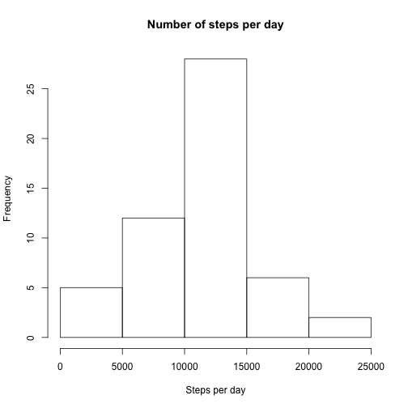
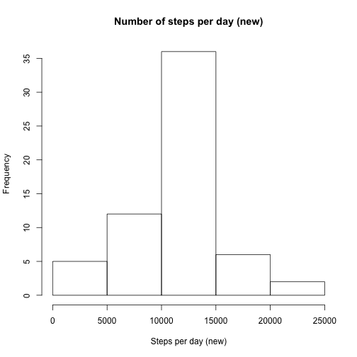

# 1. Loading and preprocessing the data

Read the dataset


```r
data <- read.csv("activity.csv", header = TRUE)
```

# 2. What is mean total number of steps taken per day?

Calculate the total number of steps taken per day


```r
data2 <- aggregate(steps ~ date, data, sum)
```

Make a histogram of the total number of steps taken each day


```r
hist(data2$steps, xlab = "Steps per day", main = "Number of steps per day")
```



Calculate and report the mean and median of the total number of steps taken per 
day


```r
print(mean(data2$steps))
```

```
## [1] 10766.19
```

```r
print(median(data2$steps))
```

```
## [1] 10765
```

# 3. What is the average daily activity pattern?

Calculate the average number of steps taken per interval


```r
data3 <- aggregate(steps ~ interval, data, mean)
```

Make a time series plot (i.e. type = "l") of the 5-minute interval (x-axis) and 
the average number of steps taken, averaged across all days (y-axis)


```r
plot(data3$steps, type = "l", xlab = "Intervals", 
ylab = "Steps per interval, average")
```


Which 5-minute interval, on average across all the days in the dataset, contains
the maximum number of steps?


```r
print(max(data3$steps))
```

```
## [1] 206.1698
```

```r
print(which.max(data3$steps))
```

```
## [1] 104
```

# 4. Imputing missing values

Calculate and report the total number of missing values in the dataset (i.e.the 
total number of rows with NAs)


```r
s <- sum(is.na(data$steps))
print(s)
```

```
## [1] 2304
```

Create a new dataset that is equal to the original dataset but with the missing 
data filled in. 
The strategy that I used was replacing the missing values with 
the mean for the corresponding 5-minute interval. 


```r
names(data3)[2] <- "stepsMean"
new_data <- merge(data, data3, by = "interval", all.x = TRUE, sort = FALSE)
new_data2 <- new_data[with(new_data, order(new_data$date)), ]
v <- character(nrow(new_data2))
		for (i in c(1:nrow(new_data2))) {
			if (is.na(new_data2$steps[i])) 
				{v[i] <- new_data2$stepsMean[i]} 
				else {v[i] <- data$steps[i]}
				}			
new_data2$imputedSteps <- v
new_data2$imputedSteps <- as.numeric(new_data2$imputedSteps)
new_data2$steps <- NULL
new_data2$stepsMean <- NULL
```

Make a histogram of the total number of steps taken each day and calculate and 
report the mean and median total number of steps taken per day.


```r
data4 <- aggregate(imputedSteps ~ date, new_data2, sum)
hist(data4$imputedSteps, xlab = "Steps per day (new)", 
main = "Number of steps per day (new)")	
```



```r
print(mean(data4$imputedSteps))	
```

```
## [1] 10766.19
```

```r
print(median(data4$imputedSteps))
```

```
## [1] 10766.19
```

These valued do not differ from the estimates from the first part of the 
assignment. This is not surprising. The "aggregate" function in the beginning 
of the assignment ignores the missing values and therefore the rows containing 
the missing values are not included in the calculation (i.e. we only have data 
for 53 days). After imputation all 61 days are used for the calculation. 
However, since missing values are replaced with the average values we are just 
propagating the mean and therefore get the same values. 

# 5. Are there differences in activity patterns between weekdays and weekends?

Create a new factor variable in the dataset with two levels -- "weekday" and 
"weekend" indicating whether a given date is a weekday or weekend day.


```r
new_data2$date <- as.Date(new_data2$date) 
new_data2$weekDay <- factor(weekdays(new_data2$date) %in% c("Monday", "Tuesday", 
"Wednesday", "Thursday", "Friday"))
levels(new_data2$weekDay) <- c("Weekday", "Weekend")
```

Make a panel plot containing a time series plot (i.e. type = "l") of 
the 5-minute interval (x-axis) and the average number of steps taken, averaged 
across all weekday days or weekend days (y-axis).


```r
dataWD <- new_data2[new_data2$weekDay == "Weekday", ]
dataWE <- new_data2[new_data2$weekDay == "Weekend", ]

dataWDmean <- aggregate(imputedSteps ~ interval, dataWD, mean)
dataWEmean <- aggregate(imputedSteps ~ interval, dataWE, mean)

par(mfrow = c(2,1))
with(dataWDmean, plot(interval, imputedSteps, type = "l", xlab = "interval", 
ylab = "steps", main = "Weekdays"))
with(dataWEmean, plot(interval, imputedSteps, type = "l", xlab = "interval", 
ylab = "steps", main = "Weekends"))
```


